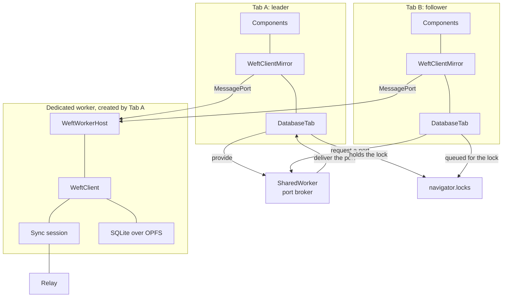
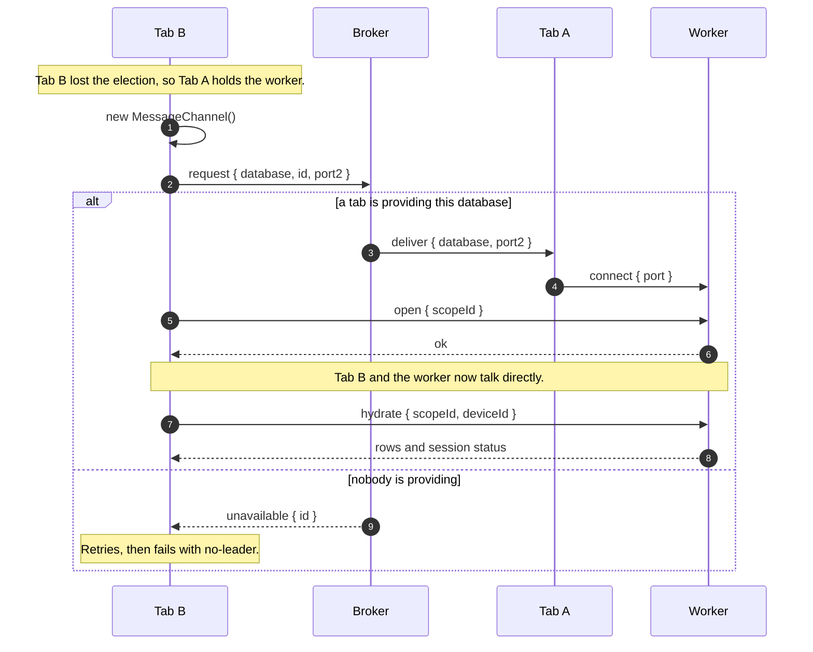
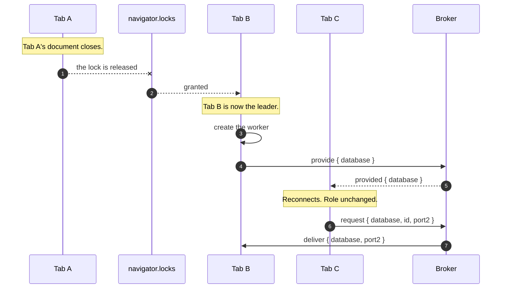

Every tab of an origin runs the same application, and one of them holds the database. The Origin
Private File System (OPFS) grants a synchronous access handle to a single document at a time, and
SQLite holds that handle for as long as the connection is open. One tab creates a dedicated worker
that opens the database, and every other tab reaches that worker over a `MessagePort` of its own.

All the tabs of one browser profile are one device. They share a device identifier, an outbox, and a
sync session, because they share the database those live in. A second tab is another view of the
same device, and produces no second participant in sync.

## The database a tab means

A device's database is identified by its namespace and its scope together. The `scopeId` says whose
rows these are; the `namespace` on the open options says which application in the origin keeps them,
and it defaults to `"weft"`. Both are strings the application supplies.

Everything that has to agree between tabs is keyed on the pair. The Web Lock the election runs on,
the registration the port broker hands ports out under, the key the device identifier is stored
under, and the OPFS pool the worker opens in all carry it. Two `openWeftDatabase` calls that agree
on both are two tabs of one database. Two that differ in either are two databases: two elections,
two workers, two device identifiers, and no message from one reaching the other.

The composed key is `<length>:<namespace>:<scopeId>`, and the leading number is the length of the
namespace. A separator alone would be ambiguous, because both halves may hold any character. Joined
with a colon, namespace `a:b` with scope `c` and namespace `a` with scope `b:c` read as one key, and
the two applications would meet on one lock, one worker, and one file. The length says where the
namespace ends, so the split is read off the key rather than searched for.

The namespace reaches the worker on the worker's own URL. `openWeftDatabase` constructs the worker
at `<worker URL>?weft-namespace=<namespace>`, and `serveWeftWorkerDefaults` reads it back from its
`location` to name the OPFS pool it installs. The URL is the channel because a worker opens its
database as it starts, before the page has said anything to it. Installing a pool takes a
synchronous access handle on every file the pool holds, so a second worker asking for the same pool
is refused it, and two namespaces in one origin need two pools. A worker assembled by hand names its
own pool
through `poolName`. A `createWorker` of an application's own receives the namespace as its second
argument, and has to carry it to the worker in some form.

## The dedicated worker

The client persists synchronously: `ClientPersistence.save(client)` returns `void`, and the write it
performs has completed by the time it returns. The only synchronous SQLite storage in a browser is
an OPFS access handle from `createSyncAccessHandle()`, which the specification defines for
dedicated workers.

Firefox 152 and Chrome 151 refuse `createSyncAccessHandle()` inside a `SharedWorkerGlobalScope`, in
keeping with the specification. Safari 26.6 allows it. The database is therefore held by a dedicated
worker, which belongs to the one document that created it.

## The parts

Tab A holds the lock, so Tab A created the worker. Tab B holds a port into that worker and speaks
the whole protocol over it, so hydrating, mutating, and watching each reach the worker in one hop.
Tab A carries none of Tab B's traffic.

The rows a component reads come from the mirror in its own tab. The worker keeps each mirror in step
by pushing every change, and only the worker touches storage.

## The lock election

One Web Lock, named `weft:<database key>:opfs`, decides which tab holds the worker. A tab requests
it with `ifAvailable: true`. The tab that receives the lock is the `leader` and creates the worker,
and a tab that receives `null` is a `follower`. The leader's callback returns a promise that stays
pending, which holds the lock open for as long as that tab leads.

The lock is per database, so a browser signed into two scopes runs a worker for each, and so do two
namespaces of one scope. The elections are independent.

A follower makes a second request for the same lock, this time without `ifAvailable`. The browser
answers that request when the lock is free. It frees the lock when the holding document closes,
crashes, is killed for memory, or is discarded from the back/forward cache. Being granted the queued
request is therefore a guarantee from the browser that the previous holder is gone. It is the only
signal a tab receives that another tab has died.

Holding the lock is the only thing that makes a tab the leader. No message from another tab, and no
message from the broker, changes a tab's role.

A browser with no Web Locks is refused at the open in every tab, with `reason` `"no-locks"`, before
any tab creates a worker. Web Locks reached Safari in 15.4, `SharedWorker` in 16.4, and OPFS
synchronous access handles in 17, so a browser that can hold the database has the lock.

## The port handover

A `MessagePort` cannot be cloned, only transferred, and `BroadcastChannel.postMessage` takes no
transfer list. A `SharedWorker` port takes one, and a port received on one connection can be sent on
down another. The broker is a `SharedWorker` with that single job. It holds no database, opens no
storage, and reads none of the worker protocol whose ports it moves.

The tab that wants the port mints it, keeps one end, and sends the other. The travelling end is
transferred at each hop, so no document that passes it on keeps a usable reference.

A registration with the broker records that a tab claimed the database, under the composed key. A
port asked for in one namespace reaches no other namespace's provider, and a port asked for in one
scope reaches no other scope's. It carries no liveness. A
connecting tab establishes that for itself: it sends `open` over the new port, and a port delivered
into a document that has gone yields no reply and no error. Silence within the probe window is a
retry, and silence until the deadline is a `no-leader` failure.

## Succession

A Web Lock grant reaches the next waiter only. The tabs further back in the queue receive nothing
from the lock, so the notice reaches them over the broker, which holds a connection to each of them
and sees the successor register.

`provided` reports that another tab is serving the database. It goes to every connection except the
one that registered, so the new leader is not told about itself and does not tear down the worker it
has just built. A tab that receives one drops its transport, asks the broker for a new port, and
hydrates again. Its role is unchanged, and `subscribeRole` on the database handle fires only in the
tab the lock was granted to.

Requests in flight when the transport drops are rejected. The outcome of a mutation issued a moment
before the worker vanished is unknown to the page, and the hydrate that follows carries whatever
committed.

The broker keeps the most recent claim per database, so a successor takes over by registering.

## Delivery to each tab

The worker runs each distinct watched statement once and sends each tab the results for the
statements that tab watches. Two tabs rendering one list share a single execution. A tab watching
nothing receives no statement results.

Row changes go to every connected tab, because a row belongs to the scope rather than to the tab
that wrote it.

| Message             | Direction      | Reaches                                 |
| ------------------- | -------------- | --------------------------------------- |
| `hydrate`           | tab to worker  | the tab that asked                      |
| `mutate`            | tab to worker  | the tab that asked                      |
| `watch` / `unwatch` | tab to worker  | recorded against that tab's connection  |
| Row changes         | worker to tabs | every connected tab                     |
| Statement results   | worker to tabs | each tab, for the statements it watches |
| Session status      | worker to tabs | every connected tab                     |

The sync session runs in the worker beside the client, and reads the outbox and the quarantine to
report what is pending. The page holds the credential, because a worker has no `localStorage` and no
redirect to read a token from. `setToken` sends it down, and a new token builds a new session.
[The sync protocol](/concepts/sync-protocol/) covers what that session does with it.

## Storage durability

A browser that declines the OPFS access handle pool is served an in-memory SQLite database instead,
and `weft.durability` reports `ephemeral` rather than `durable`. Safari's private browsing mode is
the case that reaches it.

The database is the same SQLite either way, held in memory rather than in a file. Compiled
statements, filtering, ordering, and every generated hook answer identically. Rows, the outbox, and
the quarantine all go when the window closes, and a reload starts from nothing. A device in this
mode still syncs, so work pushed to the relay before the window closes survives there.

Every tab of one database reports the same value, because every tab reads it from the one worker
holding it. The tab that created the worker learns it from its ready announcement, and a
tab handed a port learns it from the reply to its `hydrate`, which carries a `durability` field
alongside the rows.

The value is settled at the open and holds for the session, so `weft.durability` needs no
subscription. A tab that takes the database over insists on that. A crashed tab runs no teardown, so
the browser may still be releasing its access handles when the successor is granted the lock, and a
worker built in that window opens in memory. A successor that was reading a durable database
discards such a worker and builds another, up to six times over about three quarters of a second. A
device already reporting `ephemeral` accepts the first worker it is given, because in a private
window the pool fails on every attempt and waiting can only add delay.

## Failure conditions

`openWeftDatabase` reports each of these as a `WeftOpenError` carrying a `reason`, and leaves
nothing running behind a failed open.

| Condition                            | `reason`              |
| ------------------------------------ | --------------------- |
| No `SharedWorker` constructor        | `no-broker`           |
| No Web Locks                         | `no-locks`            |
| No `Worker` constructor              | `no-worker`           |
| SQLite build with no OPFS pool VFS   | `storage-unavailable` |
| Worker built from a different schema | `schema-mismatch`     |
| No tab answered within the deadline  | `no-leader`           |

`no-broker` and `no-locks` are reported in every tab, including the tab that would have held the
worker, and before any tab creates one. There is no storage mode that runs without either.

`storage-unavailable` means the SQLite build the worker was given has no `installOpfsSAHPoolVfs` on
it, so no browser could store anything durably through it. A browser declining the pool is served in
memory instead and does not reach this.

[Storage on the device](/guides/device-storage/) covers opening a database and the modules it needs.
