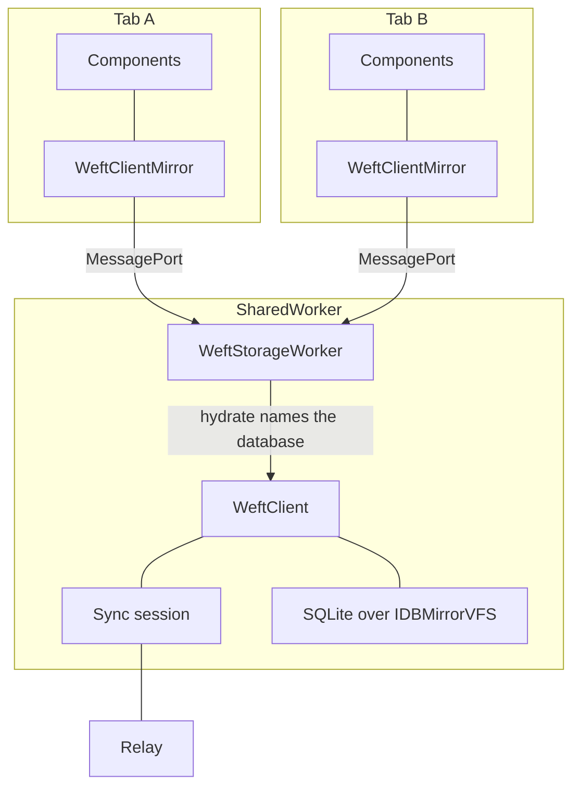

Every tab of an origin runs the same application, and one `SharedWorker` holds the database. A
`SharedWorker` is identified by its script URL, so every tab that names the same one is served by
the same instance. Each tab reaches it over a `MessagePort` of its own and speaks the whole
protocol over that port.

All the tabs of one browser profile are one device. They share a device identifier, an outbox, and a
sync session, because they share the client those live in. A second tab is another view of the same
device, and produces no second participant in sync.

## The database a tab means

A device's database is identified by its namespace and its scope together. The `scopeId` says whose
rows these are; the `namespace` on the open options says which application in the origin keeps them,
and it defaults to `"weft"`. Both are strings the application supplies.

Two `openWeftDatabase` calls that agree on both are two tabs of one database. Two that differ in
either are two databases: two clients in the worker, two device identifiers, and no message from one
reaching the other. The namespace also names the storage the file lives in, so two applications
sharing an origin keep separate IndexedDB databases.

Either half may hold any character, punctuation and separators included. Two databases whose
namespaces and scopes differ stay distinct however those strings are written.

## The storage worker

The worker holds one `WeftClient` per namespace and scope, each with the sync session that keeps it
in touch with the relay. Every read a client makes is filtered by scope, so a client that read the
whole file would load another scope's rows, outbox, and tombstones, and push them on its next
flush.

The database itself is SQLite compiled to WebAssembly over `IDBMirrorVFS`, which holds an open
database in memory and mirrors it into IndexedDB. Storage reached that way is asynchronous, and
every context can reach it, which is what lets one worker serve the whole origin.

## The parts

Both tabs reach the client in one hop. Neither carries the other's traffic, and neither touches
storage: the rows a component reads come from the mirror in its own tab, and the worker keeps each
mirror in step by pushing every change.

## Which database a port is served

A port arrives carrying no statement of which database it wants. The first request on every port is
a `hydrate`, and it carries the scope, the device identifier, and the namespace. Those name the file
to open and the client to serve the port from, and the worker opens both on the first port that asks
for them.

Anything the port sent before that routing settled is answered rather than dropped.

The reply to that `hydrate` carries the schema the worker serves. A page whose own schema hashes
differently is refused with `reason` `"schema-mismatch"`, because the worker's tables are generated
from its own copy and a page reading them would select columns the database has never had.

## Delivery to each tab

The worker runs each distinct watched statement once and sends each tab the results for the
statements that tab watches. Two tabs rendering one list share a single execution. A tab watching
nothing receives no statement results.

Row changes go to every connected tab, because a row belongs to the scope rather than to the tab
that wrote it.

| Message             | Direction      | Reaches                                 |
| ------------------- | -------------- | --------------------------------------- |
| `hydrate`           | tab to worker  | the tab that asked                      |
| `mutate`            | tab to worker  | the tab that asked                      |
| `watch` / `unwatch` | tab to worker  | recorded against that tab's connection  |
| `disconnect`        | tab to worker  | releases that tab's registrations       |
| Row changes         | worker to tabs | every connected tab                     |
| Statement results   | worker to tabs | each tab, for the statements it watches |
| Session status      | worker to tabs | every connected tab                     |

The sync session runs in the worker beside the client, and reads the outbox and the quarantine to
report what is pending. The page holds the credential, because a worker has no `localStorage` and no
redirect to read a token from. `setToken` sends it down, and a new token builds a new session.
[The sync protocol](/concepts/sync-protocol/) covers what that session does with it.

## Leaving and coming back

`dispose` sends a `disconnect`, and the worker releases what that tab registered. A worker outlives
every tab of its origin, so a registration nobody releases is a statement recomputed after every
mutation for as long as the browser keeps the worker.

The worker drops a database once its last tab has disconnected, and closes the file with it. A tab
that comes back opens both again and reads whatever committed. Holding them instead would keep one
in-memory database per namespace and scope the origin had ever opened.

A browser may stop a `SharedWorker` under memory pressure, and every port to it closes at once. The
page hears that as its port closing, constructs one at the same URL again, and re-hydrates. Requests
in flight when the port closed are rejected: the outcome of a mutation issued a moment before the
worker vanished is unknown to the page, and the hydrate that follows carries whatever committed.
Every statement the tab was watching is registered again, so its lists do not silently freeze.

## Failure conditions

`openWeftDatabase` reports each of these as a `WeftOpenError` carrying a `reason`, and leaves
nothing running behind a failed open.

| Condition                            | `reason`            |
| ------------------------------------ | ------------------- |
| No `SharedWorker` constructor        | `no-worker`         |
| No `localStorage` for a device id    | `no-device-storage` |
| Worker built from a different schema | `schema-mismatch`   |

Every tab reaches storage the same way, so a browser with no `SharedWorker` has no storage at all
and is refused before anything is opened.

[Storage on the device](/guides/device-storage/) covers opening a database and the modules it needs.
